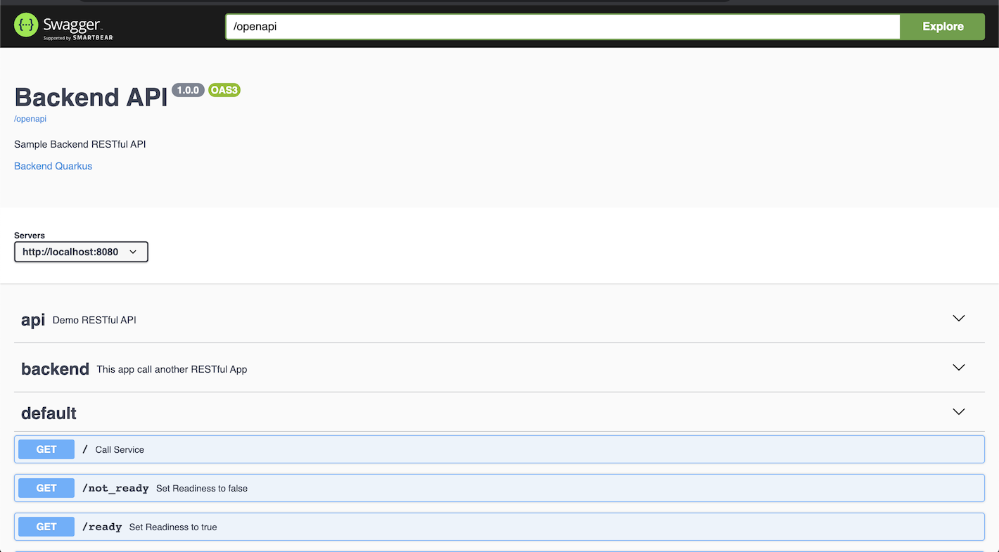

# Backend Application
```

    ____             __                  __   ___                ___            __  _           
   / __ )____ ______/ /_____  ____  ____/ /  /   |  ____  ____  / (_)________ _/ /_(_)___  ____ 
  / __  / __ `/ ___/ //_/ _ \/ __ \/ __  /  / /| | / __ \/ __ \/ / / ___/ __ `/ __/ / __ \/ __ \
 / /_/ / /_/ / /__/ ,< /  __/ / / / /_/ /  / ___ |/ /_/ / /_/ / / / /__/ /_/ / /_/ / /_/ / / / /
/_____/\__,_/\___/_/|_|\___/_/ /_/\__,_/  /_/  |_/ .___/ .___/_/_/\___/\__,_/\__/_/\____/_/ /_/ 
                                                /_/   /_/                                       

```
<!-- TOC -->

- [Backend Application](#backend-application)
  - [Overview](#overview)
    - [Application Config](#application-config)
    - [URI Supported by](#uri-supported-by)
  - [Start Coding with Quarkus](#start-coding-with-quarkus)
  - [Configuration Properties](#configuration-properties)
  - [MicroProfile  Health Check](#microprofile-health-check)
  - [MicroProfile OpenAPI](#microprofile-openapi)
  - [MicroProfile Metrics](#microprofile-metrics)

<!-- /TOC -->

## Overview

Simple RESTful Application that call another service via HTTP GET method with following features:

* RESTful API with RestEasy
* Configuration file and environment variables
* MicroProfile  Health Check
* MicroProfile OpenAPI
* MicroProfile Metrics

### Application Config

|Variable|Description|Default Value| 
| ------------- |:-------------|:----------|
|app.version|Application Version|1.0.0| 
|app.backend|target URL that backend request to|http://localhost:8080/version| 
|app.message|Message return from application|Hello, World| 
|app.showResponse|Show response from app.backend instead of app.message|false| 
|app.errorCodeNotLive|Return Code when liveness is false|504| 
|app.errorCodeNotReady|Return Code when readiness is false|503| 

### URI Supported by 

| URI        | Description  | 
| ------------- |:-------------|
|/|Return Hello Message|
|/health/live|Livenness probe URL|
|/health/ready|Readiness probe URL|
|/stop|Set liveness to false|
|/start|Set liveness to true|
|/not_ready|Set readiness to false|
|/ready|Set readiness to true|
|/version|Return App version|
|/openapi|Return OpenAPI (Swagger) document in yaml |
|/openapi?format=json|Return OpenAPI (Swagger) document in JSON |
|metrics/application|get metrics data|


## Start Coding with Quarkus
* Try [code.quarkus.org](https://code.quarkus.org) for bootstrap and discovers its extension
* Development mode. Quarkus comes with development mode which support live reload. The Changes are automatically reloaded when you update codes and configurations.

You can start development mode by using **quarkus:dev**
```bash
mvn quarkus:dev
```

## Configuration Properties
* Quarkus uses MicroProfile Config to inject by *@ConfigurationProperty* annotation.
```java
public class BackendResource {
    @ConfigProperty(name = "app.version", defaultValue = "1.0.0")
    String version;

    @ConfigProperty(name = "app.backend", defaultValue = "http://localhost:8080/version")
    String backend;

    @ConfigProperty(name = "app.message", defaultValue = "Hello, World")
    String message;

    @ConfigProperty(name = "app.errorCodeNotLive", defaultValue = "503")
    String errorCodeNotLive;

    @ConfigProperty(name = "app.errorCodeNotReady", defaultValue = "504")
    String errorCodeNotReady;

    @ConfigProperty(name = "app.showResponse", defaultValue = "true")
    String showResponse;
    
    // Some code here
}
```
* Configuration precedence from lowest to highest
  - src/main/resources/META-INF/application.properties
  - Environment variable. Remark that app.version is same as APP_VERSION
  - application.properties file store under directory /config relative path to application JAR or binary
  

## MicroProfile  Health Check
* Add Microprofile Health extension
```bash
mvn quarkus:add-extension -Dextensions="health"
```
* Health check URIs 
  - /health 
  - /health/live
  - /health/ready 

* Custom Liveness health check ([AppLiveness.java](../code/src/main/java/com/example/quarkus/health/AppLiveness.java))
```java
@Liveness
@ApplicationScoped
public class AppLiveness implements HealthCheck {

    @Override
    public HealthCheckResponse call() {
        if (ApplicationConfig.IS_ALIVE.get())
            return HealthCheckResponse.up("Live");
        else
            return HealthCheckResponse.down("Live");
    }
}
```
* Custom Readiness health check ([AppReadiness.java](../code/src/main/java/com/example/quarkus/health/AppReadiness.java))
```java
@Readiness
@ApplicationScoped
public class AppReadiness implements HealthCheck {
    @Override
    public HealthCheckResponse call() {
        if (ApplicationConfig.IS_READY.get())
            return HealthCheckResponse.up("Ready");
        else
            return HealthCheckResponse.down("Ready");
    }
}
```

## MicroProfile OpenAPI
* Add Microprofile OpenAPI extension
```bash
mvn quarkus:add-extension -Dextensions="openapi"
```

* Annotate API information for method level.(*[BackendResource.java](../code/src/main/java/com/example/quarkus/BackendResource.java)*)
```java
    @GET
    @Path("/")
    @Produces(MediaType.TEXT_PLAIN)
    @Operation(summary = "Call Service")
    @APIResponse(responseCode = "200", content = @Content(mediaType = MediaType.TEXT_PLAIN))
    public Response callBackend() throws IOException {
         // Some Code Here...
    }
```

* Create JAX-RS Application class for annotate global API information. Remark that JAX-RS Application class is not needed for Quarkus. (*[BackendApp.class](../code/src/main/java/com/example/quarkus/BackendApp.java)*)
```java
@ApplicationPath("/")
@OpenAPIDefinition(
    info = @Info(title = "Backend API",
        description = "Sample Backend RESTful API",
        version = "1.0.0",
        contact = @Contact(name = "Voraviz", url = "")),
    servers = {
        @Server(url = "http://localhost:8080")
    },
    externalDocs = @ExternalDocumentation(url = "https://gitlab.com/ocp-demo/backend_quarkus", description = "Backend Quarkus"),
    tags = {
        @Tag(name = "api", description = "Demo RESTful API"),
        @Tag(name = "backend", description = "This app call another RESTful App")
    }
)
public class BackendApp extends Application {

}
```

* Default URI for OpenAPI is */openapi*. This can be changed by setting parameter *quarkus.smallrye-openapi.path* in *[application.properties](../code/src/main/resources/application.properties)*
```properties
quarkus.smallrye-openapi.path=/openapi
```
* Test access to swagger-ui by run quarkus in developer mode using **quarkus:dev**
```bash
mvn quarkus:dev
# Use browser connect to http://127.0.0.1/swagger-ui
```

Swagger UI page



* By default, Swagger UI is included in development mode only. If you want swagger UI in your deployment. Update *quarkus.swagger-ui.always-include* to *true* in  *[application.properties](../code/src/main/resources/application.properties)*
```properties
quarkus.swagger-ui.always-include=true
```

## MicroProfile Metrics
* Add Microprofile metrics extension
```bash
mvn quarkus:add-extension -Dextensions="metrics"
```
* Annotate REST method with *@Counted* and *@Timed* (*[BackendResource.java](../code/src/main/java/com/example/quarkus/BackendResource.java)*)
```java
    @Counted(
        name = "countBackend", 
        description = "Counts how many times the backend method has been invoked"
        )
    @Timed(
        name = "timeBackend", 
        description = "Times how long it takes to invoke the backend method", 
        unit = MetricUnits.MILLISECONDS
        )
    public Response callBackend() throws IOException {
        // Some Code Here...
    }
```
* URI for get metrics data
  - /metrics - all metrics data
  - /metrics/application - only application data (from annotated to code)
  - Add header "Accept: application/json" if you want response in JSON format.
* (Optional) Setup Prometheus and Grafana for monitor application metrics. Click **[here](METRICS.md)**