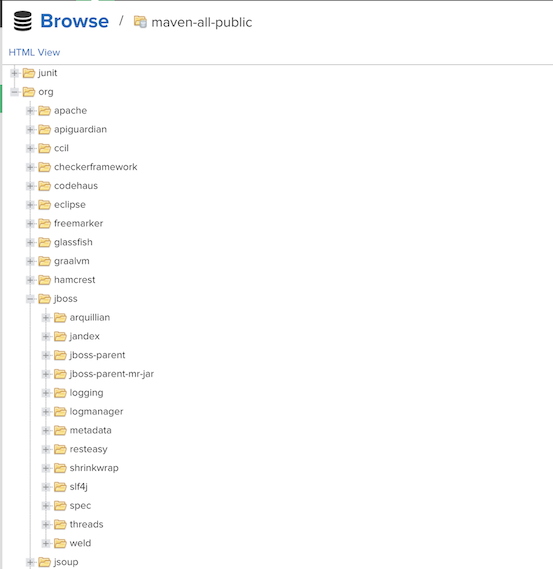
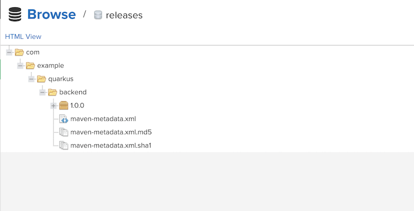
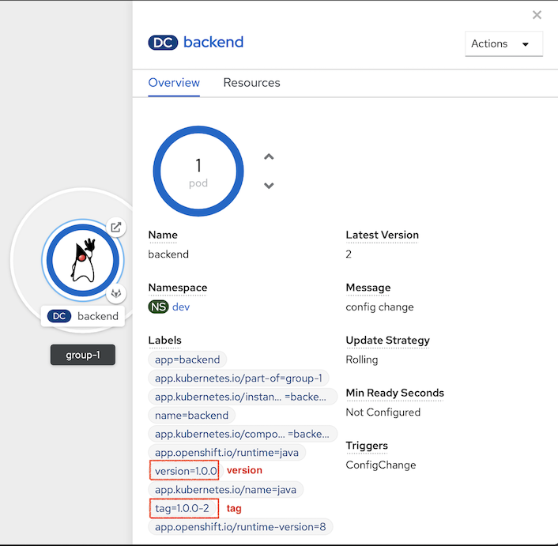
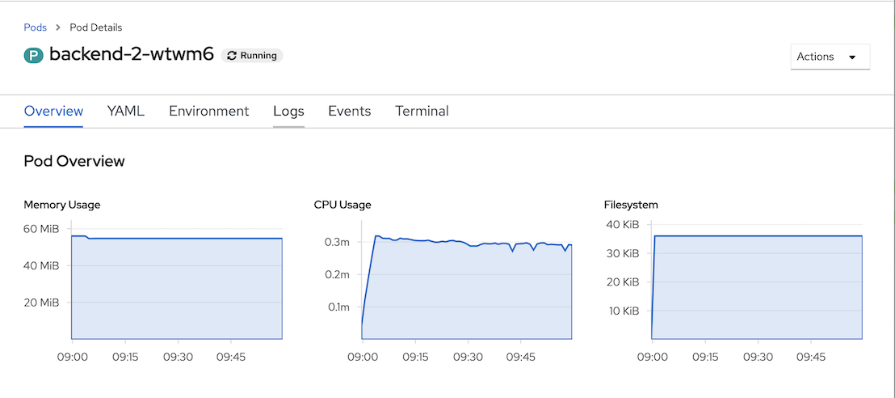
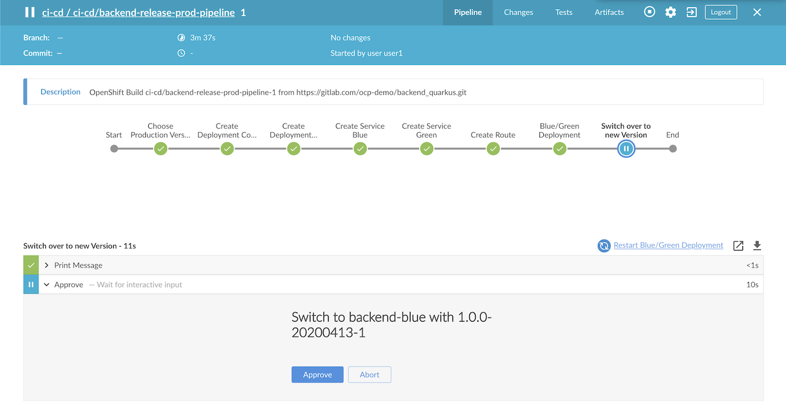
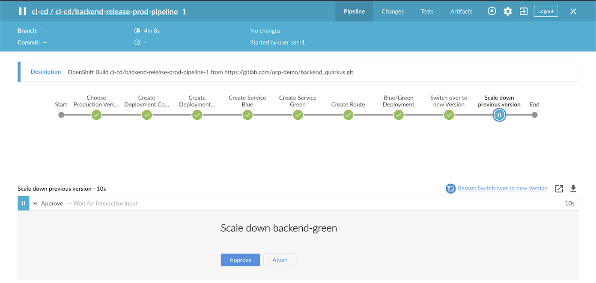
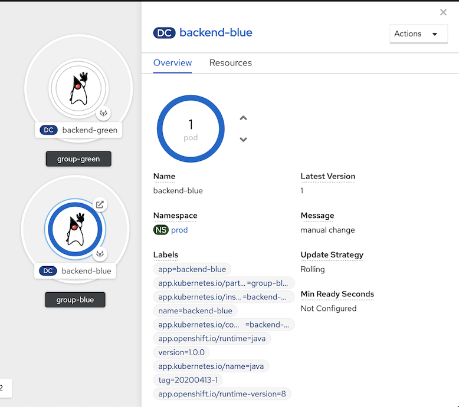
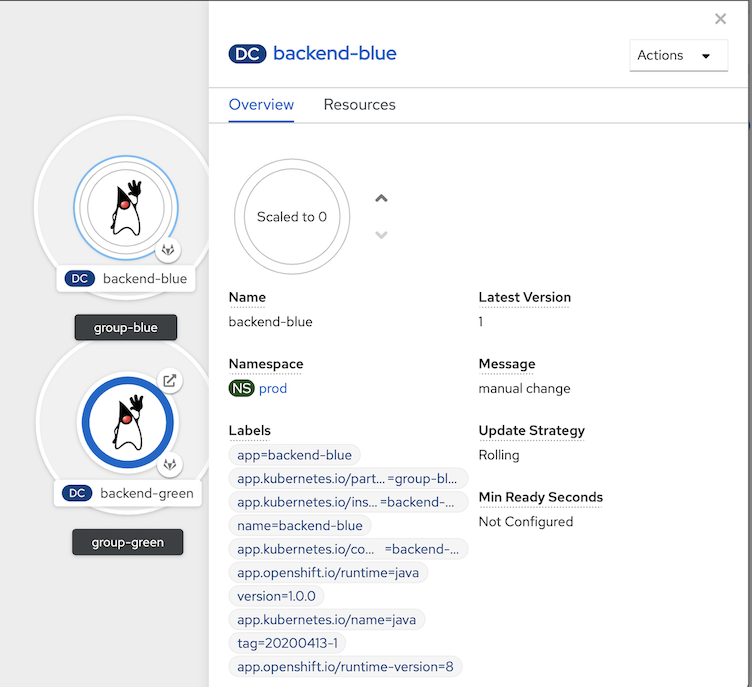

# CI/CD with Jenkins
```

   __________   ____________ 
  / ____/  _/ _/_/ ____/ __ \
 / /    / / _/_// /   / / / /
/ /____/ /_/_/ / /___/ /_/ / 
\____/___/_/   \____/_____/  
                             

```
<!-- TOC -->

- [CI/CD with Jenkins](#cicd-with-jenkins)
  - [Overview](#overview)
  - [Setup](#setup)
    - [Create Projects (Namespaces)](#create-projects-namespaces)
    - [Setup CI/CD Tools](#setup-cicd-tools)
    - [Setup Nexus](#setup-nexus)
    - [Create Pipeline](#create-pipeline)
  - [Jenkins Pipelines](#jenkins-pipelines)
    - [Build Pipeline](#build-pipeline)
      - [Run Build Pipeline](#run-build-pipeline)
    - [Release Staging Pipeline](#release-staging-pipeline)
      - [Run Release Staging Pipeline](#run-release-staging-pipeline)
    - [Release UAT Pipeline](#release-uat-pipeline)
      - [Run Release UAT Pipeline](#run-release-uat-pipeline)
    - [Production Pipeline](#production-pipeline)
      - [Run Release Production Pipeline](#run-release-production-pipeline)

<!-- /TOC -->

## Overview
Overview strategy to CI/CD pipelines as follow: 

* Jenkins and image registry stored in CI/CD project
* Deploy to Dev project (namespace) by reading source code from Git then build container,tagged with version specified in POM concat with build number and deploy to Dev project.
* Deploy to Staging project by provided drop-down menu to select container tag, then tag again with current date (YYYYMMDD) and build number, deploy to UAT Project. 
* Deploy to UAT project by provided drop-down menu to select container tag. This list will included only images those passed UAT only (contain date in tag)
* Deploy to Production by provided drop-down menu with blue/green deployment strategy.

<!-- Check for Jenkinsfile

* [Build](../Jenkinsfile/build/Jenkinsfile)
* [Release Staging](../Jenkinsfile/relese/Jenkinsfile)
* [Release UaT](../Jenkinsfile/release-uat/Jenkinsfile)
* [Production](../Jenkinsfile/relese-prod/Jenkinsfile) -->

## Setup

### Create Projects (Namespaces)

This demo consists of 5 projects

* CI/CD (ci-cd) - for tools including Jenkins (master/slave), Nexus and Sonarqube. All container images are stored in this namesapce
* Development (dev) - for developer
* Staging (stage)
* UAT (uat) - for UAT
* Production (prod)

OpenShift has security to isolate each project then we need to

* Allow project dev and uat to pull images from ci-cd
* Allow project ci-cd to managing dev, stage, uat and prod

Shell script [setup_projects.sh](../bin/setup_projects.sh) will do all above jobs.

```bash
```

### Setup CI/CD Tools

Shell script [setup_cicd.sh](../bin/setup_cicd.sh) is provided for

* Deploy Jenkins server
* Deploy Nexus and setup repoistory for container images, maven and nodejs
* Deploy SonarQube
* Create custom maven 3.6.3 with skopeo for Jenkins slave

Remark: You need to change default Nexus password. Instruction will be provided at end of shell script's output.

```bash
cd bin
#Create projects for dev,stage,uat and production
./setup_projects.sh

#Create project ci-cd, jenkins, nexus and sonarqube
./setup_ci_cd_tools.sh

#Create Jenkins slave with Maven 3.6 and Skopeo
./setup_maven36_slave.sh
```
Sample of shell script output
```bash
###########################################################################################
Jenkins URL = jenkins-ci-cd.apps.cluster-79e2.79e2.example.opentlc.com
NEXUS URL = nexus-ci-cd.apps.cluster-79e2.79e2.example.opentlc.com
NEXUS Password = e9b68dd7-e9dc-4cfe-a554-848bf23a7776
Nexus password is stored at bin/nexus_password.txt
Record this password and change it via web console
You need to enable anonymous access
Start build pipeline and deploy to dev project by run start_build_pipeline.sh
###########################################################################################
```

### Setup Nexus
Login to nexus with user admin. Initial password is stored in bin/nexus_password.txt

  * Nexus password need to be matched with password in [nexus_settings.xml](../code/nexus_settings.xml)
  * Select enable anonymous access

### Create Pipeline

Create Build Pipeline on OpenShift

```bash
oc apply -f manifests/backend-build-pipeline.yaml -n ci-cd
oc apply -f manifests/backend-release-pipeline.yaml -n ci-cd
oc apply -f manifests/backend-release-uat-pipeline.yaml -n ci-cd
oc apply -f manifests/backend-release-prod-pipeline.yaml -n ci-cd
#or run following scripts in bin directory
./create_pipelines.sh
```

## Jenkins Pipelines

Overall Pipelines details

|Pipelines|Description|Jenkinsfile Location|
|---------|---------|---------|
|backend-build-pipeline|Use binary build to create container image, run Unit Test, SonarQube scan, archive JAR to nexus and deploy to Development project|[build/Jenkinsfile](../Jenkinsfile/build/Jenkinsfile)|
|backend-release-pipeline|Select image from image tag to deploy to Staging project,tag image with YYYYMMDD-<build number> and archive container image to Nexus|[release/Jenkinsfile](../Jenkinsfile/release/Jenkinsfile)|
|backend-release-uat-pipeline|Select image from image tag to deploy to UAT project. Only image with tag YYYYMMDD-<build number> can be selected|[release-uat/Jenkinsfile](../Jenkinsfile/release-uat/Jenkinsfile)|
|backend-release-prod-pipeline|Select image from image to deploy to production with blue/green deployment. Only image with tag YYYYMMDD-<build number> can be selected|[release-prod/Jenkinsfile](../Jenkinsfile/release-prod/Jenkinsfile)|

### Build Pipeline

Build Pipeline details:

* Checkout code from Git
* Build Uber JAR by using *[nexus_setting.xml](../code/nexus_settings.xml)* for load libaries from Nexus.
* Tag with X.Y.Z-build_number. Remark that version (X.Y.Z) is retrived from [pom.xml](../code/pom.xml)
* Parallel run Unit Test and scan code by SonarQube.
* Archive Uber JAR to Nexus.
* Create Build Config, Service and Route objects if not exists.
* Build container and store container image in OpenShift's internal registry inside ci-cd project
* Create Deployment Config. This will automatically deploy to dev project.

#### Run Build Pipeline

Start pipeline via CLI with oc command, OpenShift Admin Console or Jenkins Web Console. For **oc command** 
```bash
oc start-build backend-build-pipeline.yaml -n ci-cd
#Build start with build number

oc logs build/backend-build-pipeline-<build number> -n ci-cd
#Open URL show in log for open Jenkins
```

Shell script for start build pipeline ([start_build_pipeline](../bin/start_build_pipeline.sh))
```bash
#Or run shellscript in bin directory
bin/start_build_pipeline.sh

#Sample Ouput
Build backend-build-pipeline-2 started
Wait 5 sec for backend-build-pipeline-2 to be started
info: logs available at /https://jenkins-ci-cd.apps.cluster-79e2.79e2.example.opentlc.com/blue/organizations/jenkins/ci-cd%2Fci-cd-backend-build-pipeline/detail/ci-cd-backend-build-pipeline/1/
```

Sample build pipeline result.


If you re-run build pipeline again, some stages will be skipped because there is no need to re-run for that stage


Check that backend app pod is created in dev project with label version and tag.
```bash
oc get pods -n dev
#Output
NAME               READY   STATUS      RESTARTS   AGE
backend-1-deploy   0/1     Completed   0          59m
backend-2-deploy   0/1     Completed   0          56m
backend-2-wtwm6    1/1     Running     0          56m

#Get pod backend-2-wtwm6
oc get pod backend-2-wtwm6-o yaml -n dev
```

Sample output from build number 2 with app version 1.0.0 (This is from pom.xml)
```yaml
labels:
    app: backend
    deployment: backend-2
    deploymentconfig: backend
    tag: 1.0.0-2
    version: 1.0.0
  name: backend-2-wtwm6
```
Check that build pipeline load libaries through nexus repository maven-all-public



Check that build pipeline archived applcation JAR to nexus repository releases



You can also use Develop Console to view backend app in Development project



Check for CPU and momory that is consumed by pod.



### Release Staging Pipeline

Release staging Pipeline details:

* Checkout code from Git
* Query OpenShift's internal image registry for backend container image and list only image tagged with version in format X.Y.Z
* Tag container image with format X.Y.Z-YYYYMMDD-build_number 
* Archive container image to Nexus
* Delete everythings related to backend app in staging project
* Create Service, Route and Deployment Config.

#### Run Release Staging Pipeline

Start pipeline via CLI with oc command, OpenShift Admin Console or Jenkins Web Console. For **oc command** 
```bash
oc start-build backend-release-pipeline.yaml -n ci-cd
#Build start with build number

oc logs build/backend-release-pipeline-<build number> -n ci-cd
#Open URL show in log for open Jenkins
```

Shell script for start build pipeline ([start_release_pipeline](../bin/start_release_pipeline.sh))
```bash
#Or run shellscript in bin directory
bin/start_release_pipeline.sh
```

Release pipeline will prompt for select backend container image to be released to stage project.


Sample release pipeline result.


Check that backend container image is archived to nexus repository docker


You can also use Develop Console to view backend app in Staging project


### Release UAT Pipeline

Release UAT Pipeline details:

* Checkout code from Git
* Query OpenShift's internal image registry for backend container image and list only image already passed Staging that is tagged with version in format X.Y.Z-YYYYMMDD-build_number
* Delete everythings related to backend app in staging project
* Create Service, Route and Deployment Config.

#### Run Release UAT Pipeline

Start pipeline via CLI with oc command, OpenShift Admin Console or Jenkins Web Console. For **oc command** 
```bash
oc start-build backend-release-uat-pipeline.yaml -n ci-cd
#Build start with build number

oc logs build/backend-release-uat-pipeline-<build number> -n ci-cd
#Open URL show in log for open Jenkins
```

Shell script for start build pipeline ([start_release_uat_pipeline](../bin/start_release_uat_pipeline.sh))
```bash
#Or run shellscript in bin directory
bin/start_release_uat_pipeline.sh
```

Release pipeline will prompt for select backend container image to be released to uat project.


Sample release pipeline result.


<!-- You can also use Develop Console to view backend app in Staging project

 -->

### Production Pipeline

Release staging Pipeline details:

* Checkout code from Git
* Query OpenShift's internal image registry for backend container image and list only image already passed Staiging and UAT that is tagged with version in format X.Y.Z-YYYYMMDD-build_number
* Create Deployment Config for blue version and green version. (This will not automtically pods deployment)
* Create Service for blue version and green version.
* Create Route.
* Deploy to prod project with blue/green deployment
  - Check for active version
  - Deploy new version to inactive version
  - Prompt for switch to new version. This will be done by switch route to new version (currently inactive version)
  - Prompt to scaledown previously active version.

#### Run Release Production Pipeline

Start pipeline via CLI with oc command, OpenShift Admin Console or Jenkins Web Console. For **oc command** 
```bash
oc start-build backend-release-prod-pipeline.yaml -n ci-cd
#Build start with build number

oc logs build/backend-release-prod-pipeline-<build number> -n ci-cd
#Open URL show in log for open Jenkins
```

Shell script for start build pipeline ([start_release_prod_pipeline.sh](../bin/start_release_prod_pipeline.sh))
```bash
#Or run shellscript in bin directory
bin/start_release_prod_pipeline.sh
```

Release Prod pipeline will prompt for select backend container image to be released to prod project.


Release Prod pipeline will prompt for promoting new version.



Release Prod pipeline will prompt for scale down previous version.



Sample release prod pipeline result.


Check developer console for result. Remark that there is no pod in green-group.



Re-run Release Prod pipeline again. 


Check developer console to verify that active version is switched to green-group



